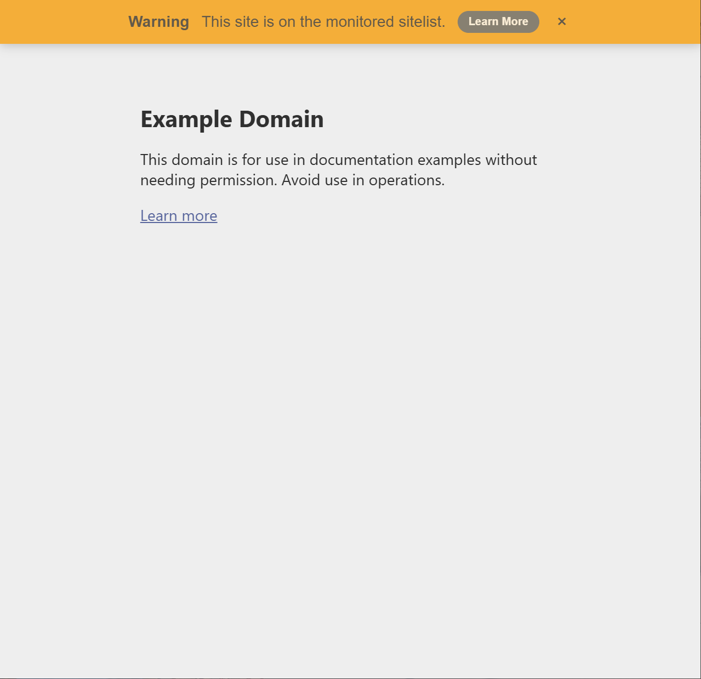
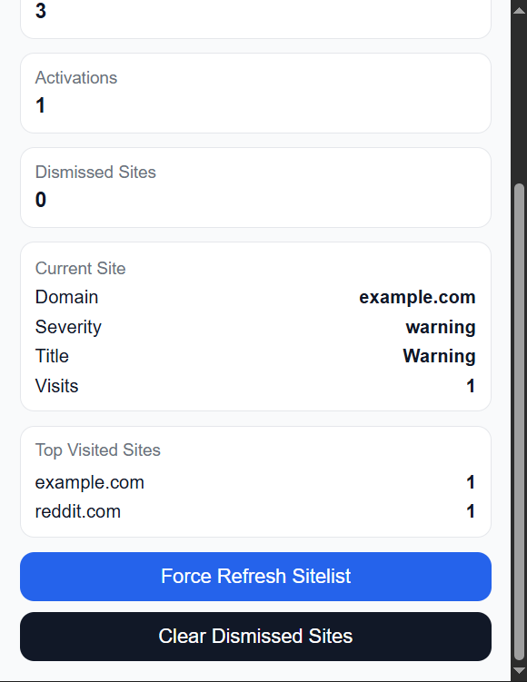
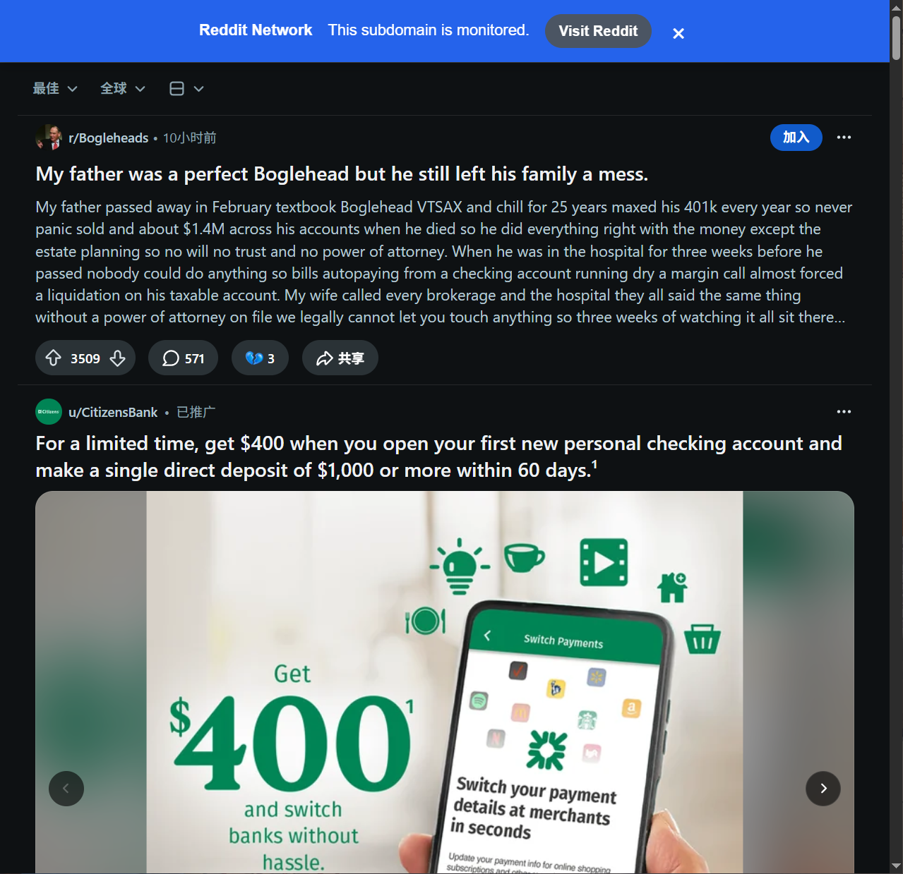
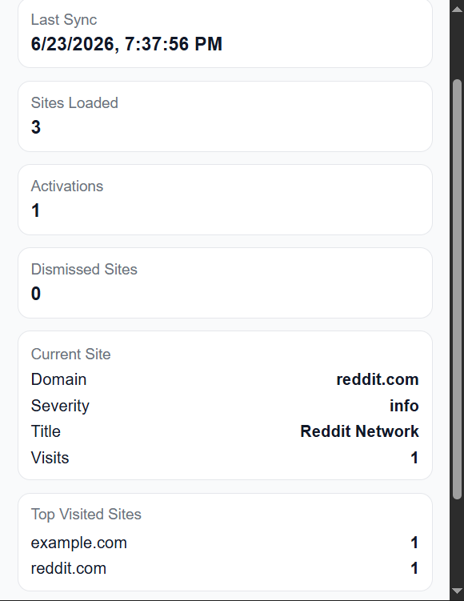

# Site Alert Bar

Chrome extension that displays customizable alert banners when visiting monitored websites from a remotely synced sitelist.

## Features

- Remote sitelist synchronization
- Wildcard domain support (`*.reddit.com`)
- Multiple alert severities
- Dismissable alert banners
- Visit tracking analytics
- Dashboard popup
- Manual sitelist refresh

---

## Alert Banner (Warning)



---

## Dashboard



---

## Wildcard Domain Support

The extension supports wildcard matching:

```json
{
  "domain": "*.reddit.com"
}
```

Example on Reddit:



---

## Site Analytics

Current matched site information and visit statistics:



---

## Tech Stack

- JavaScript
- Chrome Extension Manifest V3
- Chrome Storage API
- Node.js
- Remote JSON Configuration
